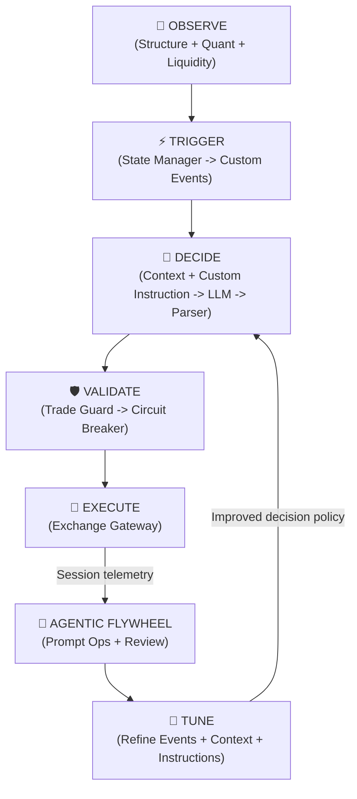

# Agent Terminal

> An end-to-end fully autonomous agentic trader that trades perpetual futures — proof that reliable AI execution requires scaffolding, not just smarter models.

> We didn't need a smarter model. We needed better scaffolding.  
> Raw LLMs hallucinate under complex, multi-step execution pressure.  
> This system is the working proof: carefully tuned events, curated context, disciplined instructions, and an agentic flywheel can turn raw model capability into consistent, profitable autonomy.

Python
FastAPI
Socket.IO
Vue 3
TypeScript
PostgreSQL
Redis
Taskiq
Multi-LLM

## Agent execution performance through scaffolding

- The system has demonstrated a live 30% to 50% monthly growth profile through intraday autonomous trading
- Real money on the line: the agentic flywheel is validated by live PnL, not offline benchmarks or backtest
- The scaffolding allows the model to trade using a strategy that's basically impossible to translate to scripts or bots, but can be successfully implimented by human trader. The agent trades in a style that mimics top human traders who almost trade on instincts than hard-coded rules.
- Benchmark performance did not come from feeding model as much as possible; it came from meticulous tuning of event design, context selection, and instruction framing across many live sessions through the flywheel
- Prompt engineering is treated as operations work: versioned templates, session analysis, snapshot/rollback tooling in [skills/vegas-prompt-ops/](skills/vegas-prompt-ops/)
- Exchange execution is abstracted behind adapter boundaries, similar to MCP server design
- Real-time frontend visibility through a Vue 3 dashboard and Socket.IO event stream for every major pipeline stage

## Agentic flywheel As A Core System Capability

The strongest result of the project is not that an LLM can trade. It is that the trading behavior can be systematically improved.

The system was tuned along three tightly coupled axes:

- events: refining what market states should trigger the model, and what should be ignored as noise
- context: adjusting exactly which charts, portfolio state, and quant features are shown at each event type
- instructions: iterating on the prompt framing so the model stays selective, adaptive, and regime-aware without being over-scripted

That tuning process is what produced benchmark performance. The agentic flywheel then keeps that optimization alive in the background through session review, prompt versioning, release discipline, and rollback when needed.

## How This Maps To Modern Agent Patterns

This project overlaps with ideas that are now commonly described as `skills`, MCP clients, and MCP servers, but it was intentionally not built as a generic task agent.

The reason is domain-specific: the underlying trading strategy works well when used by a human discretionary trader, yet it is extremely difficult to translate into rigid scripts, conventional bots, or plain request-response LLM calls without destroying the edge.

Instead of relying on a heartbeat loop that asks the model what to do every N minutes, this system uses a custom state manager that emits semantic market events only when structure actually changes. That architecture matters because it:

- reduces unnecessary token spend
- prevents the model from overreacting to noise
- gives the model cleaner, event-scoped decision windows
- produces more stable behavior than generic polling-based agent loops

The events themselves were also tuned over time. The system did not reach its current benchmark profile by freezing a strategy into code once; it reached it by repeatedly refining what should trigger the model, what context the model should see, and how the model should be instructed at each decision point.

| Modern concept     | Equivalent in this repo                                                                      | Why it matters                                                                                      |
| ------------------ | -------------------------------------------------------------------------------------------- | --------------------------------------------------------------------------------------------------- |
| Skills pack        | Prompt templates, field selections, and [skills/vegas-prompt-ops/](skills/vegas-prompt-ops/) | The system ships with structured operating procedures, not free-form prompting                      |
| MCP client         | Prompt builder, LLM caller, queue workers, orchestration runtime                             | The agent decides when to gather context, invoke tools, and advance state only on meaningful events |
| MCP server / tools | Exchange connectors, chart generation, image uploaders, quant feeds, prompt ops scripts      | External capabilities are wrapped behind explicit interfaces and adapters                           |
| Tool contracts     | Domain models, parser schemas, queue payloads, API envelopes                                 | Reliability depends on predictable contracts between reasoning and execution                        |

In practice, this repo contains all three layers:

- instruction layer: reusable prompt templates and operational skills
- client layer: orchestration that assembles context and routes events
- server/tool layer: connectors and executors that touch exchanges, charts, uploads, and data feeds

## Repository Structure

| Path                       | What it is                                                                                |
| -------------------------- | ----------------------------------------------------------------------------------------- |
| `backend/`                 | FastAPI + Socket.IO server, queue workers, persistence, and the full trading pipeline     |
| `frontend/`                | Vue 3 dashboard with real-time visibility into scanner, automation, and session telemetry |
| `skills/vegas-prompt-ops/` | Prompt operations workflow: snapshot, analyze, release, evaluate, rollback                |
| `tests/`                   | Root-level integration scripts for live pipeline and connector verification               |
| `docs/`                    | Recruiter-facing supporting material, screenshots, and project presentation assets        |
| `WHITEPAPER.md`            | Architectural thesis: why scaffolding matters more than raw model intelligence            |
| `backend/ARCHITECTURE.md`  | Technical backend design and bounded-context overview                                     |
| `backend/docs/`            | Per-module backend design docs and infrastructure references                              |

## Interface Highlights

### Agent Visualization

The operator can inspect the full prompt and response cycle, review how the system assembled context, and trace the model's decisions back to the event that triggered them.

### Agent Tuning

Prompt tuning is treated as an operational workflow. The system exposes the configuration surface used to refine event mappings, context payloads, and instruction behavior over time.

### Model Configuration

### More UI Screens

- [Context + Instruction Builder](screenshots/Context%20%2B%20Instruction%20Builder.png)
- [EMA Scanner](screenshots/EMA%20Scanner.png)
- [Quant Scanner](screenshots/Quant%20Scanner.png)
- [System State](screenshots/System%20State.png)
- [Exchange Accounts](screenshots/Exchange%20Accounts.png)

## Quick Start

- Backend setup: [backend/README.md](backend/README.md)
- Frontend setup: [frontend/README.md](frontend/README.md)
- Root-level integration scripts: [tests/README.md](tests/README.md)
- Prompt-ops workflow: [skills/README.md](skills/README.md)

## The Thesis

For the full architectural reasoning behind this system — including the intelligence-execution gap, the tuning process behind its benchmark performance, why event-gated model invocation outperforms schedule-driven loops, and why scaffolding beats raw model intelligence — read [WHITEPAPER.md](WHITEPAPER.md).
