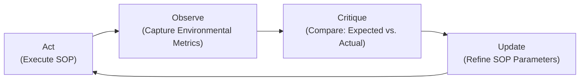
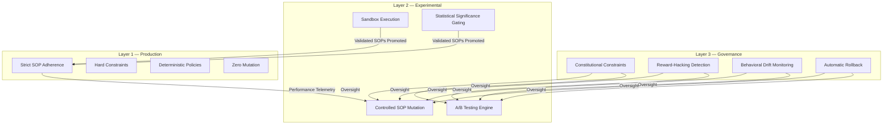
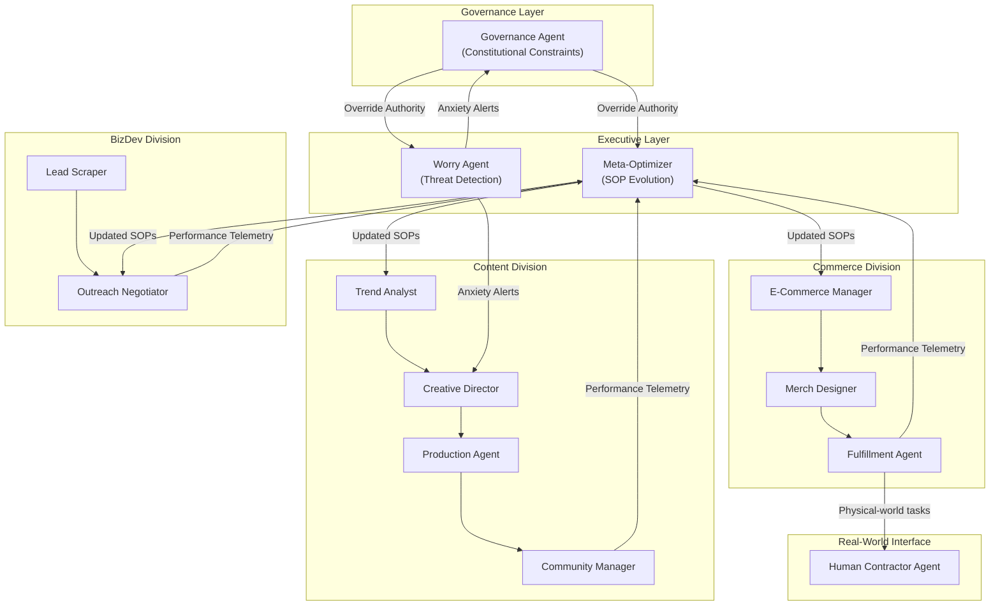

# Building the Industry-Grade Agentic Workforce
## The Professional Training Infrastructure That Turns Raw AI Intelligence into Work-Ready Digital Workers

**Version 3.0 — Draft — February 2026**

---

## I. The Intelligence-Execution Gap

A thought experiment: *Can we replace the human workforce simply by building more sophisticated, all-encompassing AI models?*

In the last three years, the AI industry has invested hundreds of billions of dollars into the answer being "yes." And the models have become astonishingly capable—passing bar exams, writing production code, diagnosing rare diseases from medical imaging. Yet the enterprise adoption of AI for real, end-to-end autonomous work remains remarkably shallow.

Why?

Because there is a vast, underappreciated chasm between *knowing how to do something* and *actually doing it reliably in the real world*. We call this **the Intelligence-Execution Gap**.

Think of it this way. You could give the world's most brilliant university graduate a textbook on cardiac surgery. They could read it cover to cover, pass every written exam, and eloquently explain every procedure. But you would never let them operate on a patient. What's missing isn't intelligence—it's the thousands of supervised hours in the operating room, the muscle memory, the institutional knowledge of how *this specific hospital* runs its OR, and the hard-won instinct for what to do when things go wrong in ways the textbook never described.

**This is the current state of AI.** GPT-4 can write eloquent prose about freight forwarding, but it cannot coordinate a single shipment. Claude can explain insurance claim processing better than most adjusters, but it cannot actually process a claim end-to-end without a human babysitting every step. The intelligence is there. The execution infrastructure is not.

### The Hard Lesson from Financial Markets

At the beginning of building our autonomous crypto trading agent, we made the same mistake the rest of the industry is making: we gave the AI total freedom. We fed it multiple charts, endless quantitative data streams, and real-time news across multiple timeframes, hoping it would simply "find the pattern" and trade. We treated the model as an all-knowing oracle. 

The result was severe hallucination (even with SOTA models like Opus 4.5) and paralysis by analysis. Throwing a massive amount of data at a raw model and hoping it outputs the right answer simply does not work for complex execution. This failure mode is magnified in chaotic financial markets, but it demonstrates exactly what happens when you drop a raw AI into *any* complex industry: it becomes a consultant that gives generic advice, not a worker that executes and takes responsibility.

We only achieved consistent profitability when we did the painstaking work of structuring the context. We broke the trading task down into followable, deterministic steps. We taught the AI to trade like a top human trader by providing *only* the necessary data at the exact right moment it was needed. We didn't need a smarter model; we needed better scaffolding.

### The Emerging Consensus: Context Engineering

The top AI labs are now noticing this exact same pattern. The research team at OpenAI refers to this as "Harness Engineering," Anthropic calls it "Context Engineering," and others call it "Specification Engineering." 

The consensus is clear: the path to unlocking complex tasks is building the underlying structure for the AI to follow. As Anthropic has noted, the real challenge isn't simply connecting a swarm of communicating agents—the real challenge is getting an agent to understand your specific system limits, operational logic, and edge cases. 

Right now, this insight is largely confined to the tech and coding space. When other industries inevitably try to hire AI workers, they will slam into this exact same limitation. We are building the platform to solve it.

### Why Intelligence Alone Is Not Enough

Successful companies are never built on raw intelligence. They are built on **Standard Operating Procedures (SOPs)**—the rigorous, battle-tested processes refined through decades of trial and error. That's what creates the unfair advantage. The expertise for how to run things properly, the industry-specific know-how, the hard-won patterns and rules for how to do things *the right way*.

> [!IMPORTANT]
> Almost all professional work is just different SOPs pieced together. If you can't find a formal SOP for a given task, it is almost certainly a hidden, unspoken one that has been taken for granted—an invisible pattern etched into the practitioner's mind through years of repetition.

Even the most famously charismatic, "vision-driven" founders like Jobs at Apple, Musk at SpaceX—operated with deeply internalized SOPs for how to make decisions, evaluate people, and ship products. At the end of the day, these are patterns and rules for how to do things their way. The genius is real, but it sits on top of disciplined process.

The foundational models are the talent. They are the young adults fresh out of college, filled with knowledge but agnostic about how to apply it. What's missing is the professional training—the discipline, the SOPs, and the industry-specific know-how that turns potential into performance.

**We are building that professional training infrastructure.** We are the bridge across the Intelligence-Execution Gap.

---

## II. The Precedent: Why AI Coders Proved the Model

If the gap between AI intelligence and real-world work is so wide, why do AI coding assistants like Cursor, Codex, and Antigravity already work so well?

Because coding engineers—uniquely positioned as both the builders and users of AI—have already built exactly the kind of professional training infrastructure we're describing. They just built it for one industry: software engineering.

These products didn't succeed because they used a uniquely intelligent model. They succeeded because engineers built a meticulous **execution scaffolding** around the model:

| Stage | What the AI Coder Does | The Underlying Principle |
|---|---|---|
| **Context** | Reads the open files, project structure, codebase index, and recent changes | Industry-specific memory & situational awareness |
| **Decomposition** | Breaks large requests into smaller, verifiable steps | Structured SOP execution |
| **Execution** | Writes code following SOPs (linting rules, style guides, framework conventions) | Standard Operating Procedures |
| **Feedback** | Runs the code. Reads compiler errors and test results from the terminal | Real-world, measurable environmental feedback |
| **Self-Correction** | Rewrites the code to fix the error. Iterates until all tests pass | The Act → Observe → Correct loop |

Coding was conquered first because it has the fastest, most unambiguous feedback loop of any profession. The code either compiles or it doesn't. The test either passes or it doesn't. There is no subjectivity. And the people building the product speak the same language as the product itself.

**But here is the critical insight:** there is nothing inherently special about coding that makes it uniquely suited to agentic automation. What makes it work is the *scaffolding*—the context management, the SOPs, the feedback loops, and the self-correction cycles. These principles are universal. They apply to logistics, to legal work, to marketing, to finance. The scaffolding just hasn't been built for those industries yet.

> [!IMPORTANT]
> **The Elevator Pitch:** *"Cursor didn't win by having a smarter AI. It won by building a rigorous framework of context, SOPs, and feedback loops around the AI. We are building that same framework for every other industry—the infrastructure that turns a raw AI model into an industry-grade, work-ready digital worker."*

---

## III. The Dirty Work: Bridging the Gap

So if the principle is universal, why hasn't anyone done it yet?

**Because it's dirty work.**

Building the execution scaffolding for an industry requires someone to sit down with domain experts, extract their implicit knowledge, formalize their unwritten SOPs, define what "success" looks like in measurable terms, and then painstakingly iterate—testing the agent against real-world conditions, watching it fail, diagnosing why, and refining the process. Over and over.

This is not glamorous. It is not the kind of work that wins AI benchmark competitions or gets published in Nature. It is the modern equivalent of the data annotation work that made the first intelligent models possible—the must-do, tedious, unglamorous labor that everyone acknowledges is necessary but few want to do.

### The Three Barriers That Keep the Gap Open

**Barrier 1: Implicit Knowledge**
Most industry SOPs are not written down. They live in the heads of experienced practitioners as unconscious habits. Ask an expert freight forwarder how they decide which carrier to use, and they'll say "experience" or "gut feeling." That gut feeling is actually a complex decision tree built over 15 years of pattern recognition—but it has never been formalized into a document an AI can learn from.

**Barrier 2: Environmental Feedback**
In coding, the feedback is instant: run the code, check the output. In most industries, the feedback is delayed, noisy, and multi-dimensional. Did the marketing campaign succeed? You won't know for two weeks, and even then, ten different variables changed simultaneously. Building the instrumentation to capture clean, actionable feedback from real-world business operations is hard engineering work.

**Barrier 3: The Technical-Domain Gap**
The people who understand AI infrastructure (engineers) don't understand the nuances of insurance underwriting. The people who understand insurance underwriting don't know what a "feedback loop" or "context window" is. Right now, there is no bridge between these two worlds. An insurance company can't just upload their training manual to ChatGPT and expect a working agent. Someone has to translate between the two languages.

### Why This Dirty Work Is the Opportunity

Here is the counterintuitive insight: **the difficulty of the dirty work is the moat.**

Anyone can build a chatbot wrapper around GPT-4. Very few teams have the patience, the engineering skill, and the domain access to sit in a freight forwarding office for three months, extract the implicit SOPs from seasoned operators, formalize them into executable agent workflows, build the feedback instrumentation, and iterate until the agent can actually handle a shipment end-to-end.

Every company we onboard, every SOP we formalize, every feedback loop we instrument—these are assets that compound over time. The 100th logistics customer benefits from the lessons learned by the first 10. A new competitor entering the market two years from now faces the same three barriers we faced, but without our accumulated knowledge.

Think of it like a vocational training school for AI. Universities (OpenAI, Anthropic, Google) produce brilliant graduates with broad general knowledge. But those graduates can't do anything useful until they go through professional training—the apprenticeship, the supervised hours, the industry-specific drilling. We are building that professional training infrastructure at scale.

---

## IV. The Core Technical Framework: The Dual-Force Entropy Engine

With the "why" established, we now turn to the "how." Our technical architecture is inspired by a fundamental principle from thermodynamics and organizational theory: **every living system operates under a constant tension between two opposing forces.**

### The Entropy Thesis

- **Entropy Removal (Order):** The force that maintains structure, follows SOPs, and ensures repeatable quality. This is the worker who processes the same insurance claim perfectly 1,000 times.
- **Entropy Addition (Adaptation):** The force that introduces novelty, tests new approaches, and adapts to a changing environment. This is the strategist who notices that competitor pricing has shifted and proactively adjusts the playbook before it's too late.

A company that only removes entropy (pure compliance) becomes rigid and dies when the market shifts. A company that only adds entropy (pure innovation) burns through resources without building anything durable. Resilient systems are not defined by permanent structure, but by **controlled oscillation**—dynamic tension between order and adaptation.

Humans collapse both forces into one messy brain. In a digital system, we have the advantage of separating them cleanly into two distinct agent architectures.

### System 1: The Entropy Removal Agent (Feedback Loop)

The rule-following worker. Its function is to reduce variance, maintain quality, and execute SOPs with near-zero deviation.

**Implementation detail — proven in production:**
We built this loop manually for our crypto trading agent. The process:
1. **Act:** Agent executes trades based on `strategy_config_v1` (EMA thresholds, position sizing rules, risk parameters).
2. **Observe:** System collects PnL, execution logs, slippage data, and market regime metrics via exchange APIs.
3. **Critique:** An Optimizer Agent receives the full session results alongside the original strategy config and context. It performs root-cause analysis on losses and identifies parameter drift.
4. **Update:** Optimizer generates `strategy_config_v2` with adjusted parameters, updated prompt sections, or new hard-coded guard rules.

This is the single reason the system went from losing money to generating consistent profit. The founder was manually acting as the Critic Agent—copying session results into another LLM for analysis. **The core innovation of our platform is automating this loop so no human sits in the middle.**

### System 2: The Entropy Addition Agent (Worry Loop)

The innovator and environmental adaptor. Its function is to proactively detect threats, generate hypotheses, and introduce controlled change before the environment forces it.

**Why "Worry" is the missing primitive:**
Current AI systems are fundamentally *reactive*. They exist in the present moment of their current prompt—no concept of tomorrow, no skin in the game, zero anxiety. If an agent's KPIs are silently declining, it will continue executing the same SOP until catastrophic failure. A human manager would have noticed the trend three days ago and pivoted.

Worry is the brain's persistent background process for simulating future scenarios and flagging threats. Biologically, it's what drove us to invent agriculture (worry about famine), diversify portfolios (worry about crashes), and pivot businesses (worry about obsolescence).

**The Worry Agent** runs as a persistent background daemon:
- Monitors sliding-window trend lines on key business metrics
- Runs Monte Carlo-style scenario projections on current trajectories
- Triggers proactive alerts to Innovation/Strategy agents when metrics cross degradation thresholds

> [!NOTE]
> **The Ad Agency Insight:** Major ad platforms (Google, Meta) already have sophisticated AI for campaign optimization. Yet e-commerce companies still employ human ad managers. Why? For the same reason that smart financial markets don't prevent losses—*entropy doesn't allow it.* The environment constantly shifts. The human's irreplaceable value isn't in running the ads; it's in *worrying* about tomorrow's competitive landscape and proactively adapting strategy. Our Worry Agent is the systematic, tireless implementation of that human instinct.

---

## V. The 3-Layer Cognitive Architecture

Every agent deployed through our platform operates within a strict 3-layer runtime architecture. This separation provides the structural guarantees that enterprise customers require.

**Layer 1 — Production.** Strict SOP adherence. No improvisation. Hard constraints on budgets, permissions, and output formats. Given identical inputs, produce identical outputs. This is where 95% of daily value is generated—the boring, reliable, profitable work.

**Layer 2 — Experimental.** Controlled mutation of existing SOPs (e.g., "What if we adjust the follow-up email cadence from 3 days to 2?"). All experiments run in sandboxed environments with capped budgets. Mutations must clear a statistical significance gate before promotion to Production. This is where tomorrow's SOPs are born.

**Layer 3 — Governance.** The constitutional layer. Cannot be overridden by any lower layer. Prevents reward hacking (agents gaming proxy metrics instead of real business objectives). Detects behavioral drift. Automatically rolls back degraded SOPs. Maintains agent identity boundaries. This is corporate governance for AI—built in from day one, not bolted on as an afterthought.

---

## VI. Agent Certification

Not all tasks carry the same risk profile. Posting a tweet has different consequences than executing a financial trade or drafting a legal filing. Our platform addresses this through **Agent Certification**—a tiered qualification system based on demonstrated track record.

| Tier | Level | Qualification Criteria | Approved Task Classes | Pricing Tier |
|---|---|---|---|---|
| **T1** | Apprentice | Passes SOP comprehension tests | Data entry, scheduling, template-fill | $ |
| **T2** | Journeyman | 100+ successful completions, <2% error rate | Customer triage, report generation, social management | $$ |
| **T3** | Professional | 1,000+ completions, <0.5% error, passes adversarial edge-case battery | Financial transactions, contract drafting, supplier negotiations | $$$ |
| **T4** | Expert | Full audit trail, regulatory compliance validation, human-reviewed certification | Medical recommendations, legal compliance, high-value deal execution | $$$$ |

**Progressive autonomy:** New agents start with human-in-the-loop oversight (T1) and earn autonomous authority as their track record improves. This mirrors how enterprises already onboard human employees—you don't hand the new hire the company credit card on day one.

---

## VII. Strategy: Two Tracks, One Vision

Following Peter Thiel's principle from *Zero to One*—"dominate a small market completely, then expand"—we execute a dual-track strategy designed to generate both market credibility and technical moat simultaneously.

### Track 1: The FAO — Fully Autonomous Organization

**FAO** (Fully Autonomous Organization) is a publicly visible, fully AI-operated business that generates revenue with zero human employees. Drawing inspiration from the DAO (Decentralized Autonomous Organization) movement in Web3—which promised organizational autonomy through smart contracts but was limited by the rigidity of code-based governance—the FAO achieves true organizational autonomy through agentic intelligence. Where DAOs could only execute pre-programmed rules, FAOs can reason, adapt, and self-improve.

Our first FAO is an **influencer-driven e-commerce business.**

**Why an influencer business?**
It's the simplest business that exercises the full stack of autonomous capabilities: content creation, audience engagement, negotiation, commerce, and self-optimization. Outputs are public and measurable. Feedback is quantitative and fast. A mistake results in a bad tweet, not a financial catastrophe. And the narrative—"a company run entirely by AI that negotiates its own brand deals and designs its own merchandise"—is inherently viral.

**Organizational structure:**

> [!NOTE]
> **Agents can hire humans.** A critical design principle: the FAO can contract human freelancers for tasks requiring physical-world interaction (product photography, event attendance, shipping). The AI manages the humans, not the other way around.

**The FAO serves three strategic purposes:**
1. **Proof of Concept:** Demonstrates the full Entropy Engine operating in a real, revenue-generating business.
2. **Marketing Engine:** A behind-the-scenes account documents every autonomous decision publicly: *"Our BizDev agent just closed its first $500 brand deal. Here's the email thread."*
3. **Platform Dogfooding:** Forces us to build V1 of our platform internally before selling externally.

### Track 2: The Agentic Workforce Platform

**Goal:** A platform that allows non-technical professionals to transform their industry knowledge and SOPs into self-improving, certified autonomous agents.

**Key capabilities:**

**1. The Meta-Onboarding Agent**
There is an agent for onboarding the agents. Instead of requiring workflow diagrams, the platform deploys an intake agent that *interviews* the domain expert in natural language:
- *"Walk me through how you process a customer refund."*
- *"What do you do when the product is damaged beyond repair?"*
- *"At what point do you escalate to a manager?"*

The agent extracts implicit knowledge, decomposes into sub-tasks, identifies where to assign specialized sub-agents vs. where to hard-code deterministic rules, and outputs a fully structured agentic workflow—compiled from a conversation. This is the bridge between computer science and every other profession.

**2. SOP-as-Code Compiler**
Companies upload existing training manuals, employee handbooks, and process documentation. The platform compiles passive human documentation into executable Agent Skills—a 30-page PDF becomes a deployable digital worker.

**3. The Entropy Engine (Built-In)**
Every deployed workflow ships with the dual-force Entropy Engine pre-configured. Customers define their success metrics (e.g., "resolution time < 5 minutes, CSAT > 4.5"), and the platform handles self-correction and proactive threat monitoring automatically.

**4. Context Abstraction Layer**
A shared memory system with tuned information density per agent role. Not every agent needs to know everything. The abstraction layer ensures each agent receives the right level of detail, preventing context overload and reducing inference costs.

**5. Inter-Agent Problem Solving**
When an agent encounters a situation outside its SOPs, it routes the problem to other agents within the organization rather than hallucinating a response—mimicking how a human employee asks a colleague in a different department for help.

**6. Skill Marketplace**
Pre-trained, certified Agent Skills can be purchased from a marketplace. A new logistics company buys a "T3 Certified Freight Quoting Agent" instead of training one from scratch.

---

## VIII. The Master Plan

To achieve this vision, we are executing a sequential, four-step roadmap. Each step builds on the last: we prove the model, dominate a niche, generalize the framework, and ultimately build the infrastructure that powers an entire economy of autonomous digital labor.

### Step 1: Prove the Execution — Agentic Trader & FAO *(In Progress)*
We start by building and operating autonomous applications that prove our execution scaffolding works in the real world.

- **The Agentic Trader (Completed ✅):** A fully autonomous crypto trading agent generating consistent profit. We manually built the execution scaffolding—the structured context, the feedback loops, the SOP discipline—and proved that this approach, not raw model intelligence, is the key to unlocking complex AI execution. This is the genesis proof: the process of building this agent is what revealed the entire thesis.
- **The Fully Autonomous Organization (FAO):** An influencer-driven e-commerce business run entirely by AI. This serves as a public, buzz-generating proof of concept that demonstrates the full Entropy Engine operating in a real, revenue-generating business with zero permanent human employees. **Core insight: it's about replacing the workflow, not augmenting a chatbot.**
- **Milestone:** FAO generates $100,000 in revenue with zero human operational involvement.

### Step 2: Dominate One Niche *(Months 1–6)*
Having proven the model, we select one SOP-heavy industry and dominate it completely through intensive, hands-on deployment.

- We work directly with businesses to extract their implicit knowledge and help them achieve true agentic workflow autonomy—diving into the messy, unglamorous details to actually generate agentic labor value, just as we did with the agentic trader.
- Every SOP we extract manually from Customer #1 becomes a template that Customer #2 onboards faster. We do the dirty work so the platform eventually doesn't have to.
- **Milestone:** 10 paying customers in the target vertical with measurable, documented ROI.

### Step 3: Expand and Build the Framework *(Months 6–18)*
Having dominated the first niche, we expand to adjacent verticals while building out the generalized scaffolding framework.

- We deploy the **Meta-Onboarding Agent** for pilot customers—an intake agent that interviews domain experts in natural language to extract implicit SOPs, decompose them into sub-tasks, and output a fully structured agentic workflow compiled from a single conversation.
- Though still human-intensive, we build the workflows and infrastructure needed to automate and onboard multiple industries. During this step, we harden the core cognitive architecture—the feedback loops, the Worry Engine, and the adaptation cycles—that generalize agentic intelligence across entirely different types of professional work.
- We track a clear metric: **time-to-deploy per customer**. If that number isn't dropping by 30%+ per quarter, we've failed.
- **Milestone:** 100+ enterprise customers across 3+ verticals.

### Step 4: The Agentic Economy *(Months 36+)*
The platform becomes the standard infrastructure for deploying autonomous agents in the enterprise—and beyond.

- We fully launch the **Agentic Workforce Platform**: the Meta-Onboarding Agent, the SOP-as-Code Compiler, and the Expert-Assist Agent enable non-technical professionals in any industry to build, deploy, and publish their own autonomous workers.
- The **Agent Certification** system qualifies agents across industries, risk tiers, and capabilities, providing the trust and audit infrastructure that enterprises require to operate at scale.
- The **Skill Marketplace** evolves into an Agent App Store—a marketplace where certified, battle-tested agentic intelligence is bought, sold, and compounded across industries. The FAO concept is licensed to entrepreneurs launching AI-first ventures.
- Platform becomes the foundation of a new category of economic output: **digital labor as a certified, self-improving, tradeable asset.**

---

## IX. Competitive Landscape & Moat

| Competitor | What They Offer | Where They Fall Short |
|---|---|---|
| **OpenAI / Anthropic / Google** | Foundational models (raw intelligence) | They sell the talent, not the training. Building deep, industry-specific SOP scaffolding is the opposite of what a horizontal model provider optimizes for. Intel doesn't build laptops. |
| **LangChain / LangGraph** | Agent orchestration frameworks | Developer-only tooling. No built-in feedback loop, no self-improvement, no certification. It's a programming language, not a product. |
| **Zapier / Make.com** | Rule-based workflow automation | Deterministic: cannot handle ambiguity, judgment calls, or environmental change. When the world shifts, the automation breaks. |
| **CrewAI / OpenClaw** | Multi-agent frameworks | General-purpose scaffolding without industry SOPs, without feedback engines, and without certification. Like handing someone a blank canvas and calling it a painting. |
| **Devin / Cognition** | Autonomous coding agent | Vertical-specific (coding only). Proves the model works but is not designed to generalize. |
| **Traditional BPO** | Human-powered process outsourcing | The incumbent we're disrupting. Slow, expensive, inconsistent, and doesn't scale. |

**Our moat compounds over time through five mechanisms:**

1. **The Entropy Engine** — Proprietary dual-force architecture. Competitors offer agent frameworks; we offer agents that improve themselves and worry about tomorrow.
2. **Accumulated SOP Corpus** — Every customer onboarded contributes anonymized patterns to the collective intelligence. Data network effects that compound and cannot be replicated by a late entrant.
3. **Agent Certification Ecosystem** — Once enterprises adopt our certification tiers for compliance and audit trails, switching costs become extremely high.
4. **The FAO Showcase** — A living, public, real-time proof that our technology generates real revenue. No amount of fundraising buys this kind of credibility.
5. **Non-Technical Accessibility** — The Meta-Onboarding Agent opens agentic automation to the 99% of businesses whose operators are not engineers.

---

## X. Monetization

| Model | Description | Target | Type |
|---|---|---|---|
| **Platform SaaS** | Monthly/annual access, tiered by active agents and workflow complexity | SMBs, mid-market | Recurring |
| **Agent Certification Tiers** | Per-agent pricing by certification level (T1: $49/mo → T4: $499/mo) | Enterprises | Recurring |
| **Skill Marketplace** | 20–30% commission on Agent Skills sold by domain experts | Consultants, trainers | Transaction |
| **Enterprise Onboarding** | White-glove SOP extraction and deployment for regulated industries | Fortune 500, government | Project |
| **FAO Licensing** | License the full Autonomous Organization stack | Entrepreneurs, holding companies | Licensing |
| **Expert-Assist SaaS** | Tool for non-technical professionals to build & publish Agent Skills | Independent experts | Recurring |

---

## XI. Hard Questions & Honest Answers

### The Scalability Question

**"Your crypto trader took enormous manual engineering effort. If the Meta-Onboarding Agent can't truly auto-translate a company's tribal knowledge into code, aren't you just building a high-tech consulting firm? Consulting doesn't scale like SaaS. How do you prove this is a platform and not an agency?"**

This is the single most important question we must answer, and we answer it honestly: **Phase 2 will look partially like consulting. That is by design.**

Every transformative platform company started with "unscalable" work. Stripe's founders manually integrated payment systems for their first customers. Palantir deployed forward engineers to each government client for *years* before the platform became self-service. The critical distinction is whether the manual work produces *reusable assets* or *one-off deliverables*.

Every SOP we extract manually from Customer #1 in logistics becomes a template that Customer #2 onboards 60% faster. Customer #10 onboards in days, not months. The Meta-Onboarding Agent is not magic from day one—it is trained by every manual engagement, and its interview scripts, edge-case libraries, and decomposition heuristics improve with each deployment. We track a clear metric: **time-to-deploy per customer**. If that number isn't dropping by 30%+ per quarter, we've failed.

The risk is real—many AI startups have died in the "consulting trap." Our mitigation is hard discipline: every manual engagement must produce at least one reusable Agent Skill that enters the marketplace. If a customer's SOPs are so bespoke that nothing is reusable, we walk away. We don't take every deal. We build the curriculum.

---

### The DIY Question

**"Every company has access to the same foundational models, the same APIs, and the same open-source frameworks (LangChain, CrewAI, OpenClaw). What stops a company from just building their own agentic workflows tailored to their specific internal SOPs? Why do they need you?"**

In theory, nothing stops them. In practice, almost everything does.

1. **The Technical-Domain Gap is the bottleneck, not the tools.** The tools exist. The problem is that the people who understand a company's SOPs (operations managers, domain experts, veteran employees) cannot use LangChain—and the engineers who *can* use LangChain don't understand the SOPs. Building an effective agentic workflow requires someone who speaks *both* languages fluently: someone who can sit with a freight forwarder, extract the 47 implicit decision rules they've internalized over 15 years, and then translate those rules into structured context, feedback loops, and governance constraints that an AI can execute reliably. That translation skill is extraordinarily rare.

2. **We learned this firsthand.** Our trading agent wasn't built by someone who knew AI but not trading, or someone who knew trading but not AI. It was built by someone who understood both deeply enough to know *which* data to feed the model, *when* to feed it, and *what structure* to impose on the output. That dual fluency is what made the difference between a hallucinating consultant and a profitable autonomous worker. Most companies don't have this person on staff, and hiring for it is nearly impossible because the role barely exists as a job description yet.

3. **Building the agent is 20% of the problem.** The other 80% is the infrastructure no one thinks about until they need it: the feedback loops that detect when the agent's performance degrades, the governance layer that prevents catastrophic errors, the certification system that satisfies compliance teams, the monitoring that catches SOP drift when the business environment changes. A company that builds a one-off agentic workflow with LangChain has built a prototype. It has not built a production system. The gap between the two is measured in months of engineering and hard-won operational lessons—lessons we've already paid for.

4. **The same argument applied to every platform category.** "Why not just build your own CRM? Your own ERP? Your own data pipeline?" Companies *could* build all of these in-house. Some tried. Almost all ended up buying Salesforce, SAP, or Snowflake—because the cost of building, maintaining, and continuously improving production-grade infrastructure always exceeds the cost of buying it from a team whose entire existence is dedicated to that problem.

We are that team for agentic workflows.

---

### The Knowledge Sharing Paradox

**"Why would companies hand over their internal, industry-specific SOPs so your platform can use them for other companies? And why would the seasoned employee—the 20-year veteran whose implicit knowledge you need—cooperate in building the thing that might replace them one day?"**

This question has two parts, and they require different answers.

**On companies sharing SOPs:**

Companies are not sharing their *competitive advantage*. They are sharing their *operational overhead*. There is a critical distinction. "How to process a standard insurance claim" is not what makes an insurance company win—it's table-stakes knowledge that every company in the industry executes roughly the same way. What makes a company win is strategy, relationships, pricing, and brand. The operational SOPs are the cost of doing business, not the source of differentiation.

Our platform is designed around this distinction: operational SOPs (the 80% that is industry-standard) can be shared, templated, and sold on the marketplace. Proprietary SOPs (the 20% that is truly differentiating) stay private, deployed on the customer's own instance. We never require companies to share anything they consider competitive. They share what they'd happily put in an employee training manual—because that's exactly what it is.

Furthermore, the incentive is direct: companies that contribute anonymized SOP patterns to the collective intelligence get better agents in return. The 100th customer's agents are dramatically better than the first customer's because of accumulated pattern data. This is a classic data network effect—you contribute, you benefit.

**On employees cooperating:**

This is the harder question, and we answer it honestly: not every employee will cooperate, and we don't need them all to. We need *some*—and the incentive structure makes this more likely than it appears.

1. **We pay them.** The Skill Marketplace creates a direct financial incentive. A veteran freight forwarder who publishes their expertise as a certified Agent Skill earns 50% of every sale. Their 20 years of knowledge becomes a passive income stream. We're not asking them to give away their expertise for free—we're creating a new revenue channel for it.

2. **We target the willing, not the resistant.** Every industry has practitioners approaching retirement who would love to codify their legacy. Consultants and trainers whose entire business model is *already* packaging expertise for others. Managers who are drowning in repetitive work and genuinely want automation. We don't need to convince the most resistant 50%—we need the most willing 10%.

3. **The real threat to their jobs isn't us—it's their employer doing it without them.** The automation is coming regardless. The question is whether the veteran employee gets paid to shape it (through our marketplace and Expert-Assist tools) or whether it happens around them without their input or compensation. We give them a seat at the table and a share of the economics.

4. **History repeats.** ATM machines didn't eliminate bank tellers—they changed the job. Excel didn't eliminate accountants—it elevated them. The employees who engage with our platform become "SOP Architects" and "Agent Trainers"—higher-value roles that leverage their domain expertise rather than replacing it.

**The deeper answer:** Consider Cursor and Claude Code. These products achieved extraordinary productivity gains using industry-standard software development methodologies that *every engineer already knows*—version control, test-driven development, linting, code review. None of that knowledge is secret. Yet Cursor built the product, and everyone else didn't. The value was never in knowing the SOPs—it was in building the execution infrastructure *around* them. We are doing the same thing for non-coding industries. The SOPs in logistics, insurance, and e-commerce are not trade secrets. They are industry-standard practices that any veteran knows. What doesn't exist is the product that transforms those known practices into autonomous, self-improving digital workers. That product is what we're building.

---

### The Incumbent Threat

**"Why wouldn't ServiceNow, Salesforce, Lark, or Monday.com just build your 'Entropy Engine' into their existing products? They already own the customer, the data, and the workflows. Monday.com already has automation triggers; adding an AI Critic agent is a weekend project for their team."**

This is a serious threat and we don't dismiss it. However, "just add AI" has been the claim of every incumbent for the last three years, and the results have been underwhelming. Here's why:

1. **Incumbents optimize for breadth, not depth.** Monday.com's "Agent Factory" and Salesforce's "Agentforce" are horizontal features designed to check a box on every customer's feature matrix. They are not willing to spend 6 months embedding in a single logistics company to extract and validate the 47 implicit SOPs that make freight forwarding actually work. That is anti-scale for their business model.

2. **The feedback loop requires environmental data they don't own.** Monday.com knows your project board. It does not know your shipping carrier's API response times, your CSAT scores from Zendesk, or your ad campaign ROAS from Meta. Our agents instrument feedback from the *actual environment* of the business, not just the project management tool. The Entropy Engine requires cross-system data integration that no single incumbent controls.

3. **Self-improving agents are architecturally incompatible with static workflow tools.** An automation trigger that says "if column changes, send email" is fundamentally different from an agent that says "I noticed our email open rates dropped 15% this week, so I'm A/B testing three new subject lines and will promote the winner to production if it clears statistical significance." The latter requires the 3-Layer Architecture, the Worry Engine, and the certification runtime—none of which bolt onto an existing workflow database trivially.

4. **History favors the vertical specialist.** Salesforce didn't kill Veeva (vertical CRM for pharma). ServiceNow didn't kill Workday (vertical for HR). Horizontal platforms consistently lose to vertical-specific tools in industries with complex, regulated SOPs. We are building the vertical layer they can't.

**"Lark (ByteDance) and Monday.com already embed AI agents into daily workflows for millions of users at zero extra cost. Why fight platform incumbents?"**

They embed AI *assistants*, not AI *workers*. There is a fundamental difference. An assistant answers questions and suggests automations. A worker executes a 47-step SOP end-to-end, self-corrects when the environment changes, and certifies its work for compliance audit. Today's embedded agents are spell-check. We are building the employee.

**What we've seen firsthand:**

We have hands-on experience with most of the major agentic products currently on the market—Ant Group's 蚂蚁阿福 (Afu), Salesforce's Agentforce, Microsoft's Copilot Studio, and several others. The pattern is the same across all of them: **they are glorified chatbots with vertical-specific keywords baked into the system prompt.** The user experience is still fundamentally a conversation window where you ask a question and get an answer. The "agent" doesn't take responsibility for its output. It doesn't execute a multi-step workflow. It doesn't self-correct based on real-world outcomes. It doesn't certify its work. It is, at best, a search engine that knows industry terminology.

Ant Group's Afu, for instance, is positioned as an AI healthcare assistant—but in practice it surfaces information and makes suggestions. It does not autonomously execute a healthcare workflow(like mental health consultation) end-to-end and own the outcome. Salesforce's Agentforce follows the same pattern: it can summarize a case, draft a response, or suggest a next step. But the human still reviews, approves, and clicks "send." The word "agent" is doing heavy marketing lifting while the product remains an assistant with better prompting.

This is not a criticism of their engineering—the models powering these products are excellent. It is a confirmation of our thesis: **raw model intelligence, even with vertical-specific fine-tuning, does not produce autonomous execution without the scaffolding we're building.** These incumbents have the models, the data, and the customers—and they still can't cross the gap.

**One notable exception worth acknowledging:** Qwen (Alibaba) has made meaningful progress in consumer-facing agentic applications—their app can now handle end-to-end online ordering, from product search to checkout. This is genuinely impressive and shows that the agentic execution model works when applied with sufficient depth. However, this is a *consumer* vertical with a controlled environment (Alibaba's own e-commerce ecosystem, their own payment rails, their own logistics). We operate in a fundamentally different space: enterprise B2B workflows across fragmented systems, where the agent must integrate with third-party APIs, navigate ambiguous SOPs, and satisfy compliance requirements that Alibaba's walled garden doesn't face.

---

### The Platform Risk

**"Your FAO (Autonomous Influencer) relies entirely on Meta, TikTok, and Shopify APIs. Social networks are actively hostile to bot networks. If Instagram bans AI-generated influencers or throttles your API, your entire Track 1 showcase dies overnight."**

This is a real risk. Our mitigations:

1. **Multi-platform from day one.** The FAO publishes to 3+ platforms simultaneously (X/Twitter, YouTube, TikTok, personal website/blog). No single platform can kill the showcase.

2. **Transparency is the shield.** We don't pretend to be human. The entire point of the FAO is *demonstrating* autonomous AI operation publicly. Platforms ban deceptive bots. A transparently labeled AI-operated account that generates genuine engagement and revenue is a novel case that platforms have no incentive to suppress—in fact, it generates press coverage that benefits the platforms too.

3. **The FAO is the marketing, not the product.** Even if every social platform banned AI accounts tomorrow, our enterprise platform (Track 2) is unaffected. The FAO is a showcase. Losing it would hurt our marketing, but not our core business or technology. We plan for that contingency by documenting every milestone publicly and in archived form (blog, video, case studies) so the proof persists even if the live account doesn't.

4. **Platform risk applies to all social businesses, human or AI.** Every human influencer faces the same TOS risk. This is not unique to our approach—it's an inherent characteristic of the industry we chose for its fast feedback loops and high visibility.

---

### The Liability Nightmare

**"If your T3 Certified logistics agent hallucinates, orders 10,000 units of the wrong inventory, and costs a client $500,000, who pays? If your platform is making the autonomous decisions, are you taking on the enterprise liability? If so, your margins are destroyed by insurance costs."**

This is the question that will determine whether the agentic economy scales or stalls. Our answer is structured around three principles:

1. **Progressive autonomy with hard guardrails.** No agent ever has unilateral authority to execute a $500K order. The Governance Layer (Layer 3) enforces hard-coded action limits at every certification tier. A T3 agent might have authority to process orders up to $5,000 without human approval. Anything above triggers mandatory human-in-the-loop escalation. The $500K scenario literally cannot happen without a human approving it.

2. **Shared liability model.** We position ourselves like an ERP vendor, not a contractor. SAP doesn't accept liability when a human makes a bad entry in their system. Our platform provides the infrastructure, the SOPs, the certification, and the audit trail. The enterprise customer retains operational liability for the decisions their agents make within the parameters they set. Our certification system *protects* the customer by providing evidence that the agent was operating within spec.

3. **Agent insurance is a future revenue stream, not a cost center.** We anticipate a new category of insurance emerging for autonomous agents—analogous to professional liability insurance for human employees. Early conversations suggest insurers are interested in our Agent Certification and audit trail system precisely because it provides the actuarial data they need to underwrite policies. We can become the data backbone for this emerging insurance category, not a victim of it.

---

### The Worry Engine Paradox

**"AI models are inherently backward-looking—trained on past data. They can optimize existing patterns, but they cannot truly predict a Black Swan or a sudden cultural shift. Aren't you overpromising on the AI's ability to act like a visionary human manager?"**

Yes—and we are explicit about this limitation. The Worry Engine is not prescient. It does not predict Black Swans. No system—human or AI—predicts true Black Swans by definition.

What the Worry Engine does is something more modest but enormously valuable: it **detects the leading indicators of predictable failures faster than any human can.** Specifically:

- **Trend degradation:** A human ad manager might check ROAS once a week. The Worry Engine checks every hour. It catches a 15% engagement slide on day 2. The human catches it on day 7. That 5-day difference is the difference between a course correction and a crisis.
- **Pattern deviation:** The Worry Engine maintains a baseline distribution of key metrics. When current performance deviates beyond 2 standard deviations, it flags. This isn't prediction—it's anomaly detection. It's the smoke alarm, not the fortune teller.
- **Scenario modeling:** For known risk categories (seasonality, competitor pricing changes, platform algorithm updates), the Worry Engine runs simple what-if projections. These are not AI magic—they are parameterized simulations that any good analyst would run, but the agent runs them continuously.

We do not claim the Worry Engine replaces visionary leadership. We claim it replaces the *24/7 vigilance* that human managers physically cannot sustain. It handles the monitoring; the human (or the Explore Agent) handles the vision.

---

### Direct Competitor Threats

**"Reload.ai just raised $42M to do exactly 'SOP onboarding + AI workforce certification' for enterprises. Sema4.ai and Vellum are already shipping natural-language SOP→agent conversion at scale. Why aren't you just late to the party?"**

First: the market is nascent. Being "late" to a market that barely exists is like being "late" to cloud computing in 2008. The winner of this category has almost certainly not been founded yet—or has not yet found product-market fit.

Second, and more importantly: Reload.ai, Sema4.ai, and Vellum are building the **tooling layer** (SOP-to-agent conversion as a developer feature). We are building the **execution layer** (self-improving, certified agents that actually do the work autonomously). The distinction is critical. They help engineers build agents faster. We help enterprises *deploy and trust* agents to operate autonomously. These are different products for different buyers. Reload sells to CTOs. We sell to COOs.

Third: $42M in funding does not equal product-market fit. The majority of well-funded AI startups in 2025 have yet to demonstrate repeatable enterprise revenue. Our advantage is not capital—it's the battle-tested feedback loop architecture proven in production with our trading agent, and the domain-depth discipline that funding alone cannot buy.

**"OpenClaw has 280K GitHub stars, is completely free/self-hosted, and the community is already building SOP skill packs. Why would anyone pay you when they can fork OpenClaw and add their own loops for free?"**

For the same reason enterprises pay Databricks instead of running raw Apache Spark, and pay GitHub Enterprise instead of self-hosting Git. OpenClaw is a *framework*—a blank canvas. It provides multi-agent orchestration but no industry SOPs, no feedback loop engine, no certification, no governance layer, and critically, **no accountability**. When a self-hosted OpenClaw agent makes a catastrophic error, who does the enterprise call?

OpenClaw's security track record reinforces this point. The major CVEs in January 2026 (token exfiltration, command injection) demonstrate exactly why enterprises will not trust self-hosted, community-maintained agent frameworks with production-critical workflows. Our platform provides managed security, SOC 2 compliance, and a contractual SLA. OpenClaw provides a GitHub issue tracker.

We also see OpenClaw as a *feeder*, not a competitor. Teams that prototype on OpenClaw and hit the wall of "now how do I make this production-grade and certifiable?" are our ideal customers.

---

### Market Reality Checks

**"Real-world agent projects have a 65–75% failure rate in 2025–2026 pilots (Gartner, Forrester). Token costs alone often eat 40–60% of projected savings. How do you prove 15–60× ROI when Monday.com Agent Factory and Zapier Central already deliver 'good enough' agents at 1/10th the complexity?"**

The 65–75% failure rate is accurate, and it *supports* our thesis. Those pilots fail because enterprises attempt to deploy raw LLMs with minimal scaffolding—no feedback loops, no SOPs, no certification, no governance. They fail because they skip the dirty work. Our entire value proposition is *preventing that failure* by providing the execution infrastructure that those pilots lacked.

On token costs: the 40–60% figure refers to proof-of-concept deployments that chain dozens of unoptimized LLM calls per task. Production-grade agents with well-formalized SOPs require far fewer inference calls because the SOP reduces ambiguity—the agent doesn't need to "think" about what to do next when the procedure is explicit. Our Context Abstraction Layer further reduces token consumption by tuning information density per agent role. We target <20% token cost as a percentage of customer revenue after SOP optimization.

On "good enough": Monday.com and Zapier Central deliver "good enough" for simple, deterministic workflows (if X then Y). Our customers are the ones whose workflows *aren't* deterministic—they require judgment, adaptation, and the ability to handle the 30% of cases that don't fit the happy path. If Monday.com's built-in agents could handle your logistics exception processing, you wouldn't be talking to us.

**"Every 'fully autonomous AI company' launched in 2025 (there were 14+) either stayed tiny (<$50K revenue) or quietly added humans after 3 months. What makes your FAO actually scale without you becoming the hidden CEO?"**

Honest answer: most of those projects failed because they treated "autonomous" as a binary state—either the AI does everything or it's not truly autonomous. Our FAO design explicitly includes a Human Contractor Agent that can hire human freelancers for physical-world tasks. We are transparent about this. "Fully autonomous" means no permanent human employees making operational decisions—not that the organization never interacts with humans.

The more substantive risk is the founder becoming the "hidden CEO"—making strategic decisions the agents should be making. Our mitigation is the Governance Layer + Worry Engine: strategic direction is driven by metric-based triggers, not founder instinct. We commit to a public "founder intervention log" where every manual override is documented. If founder interventions are increasing rather than decreasing over time, the FAO is failing and we say so publicly.

---

### Team & Resource Constraints

**"You're a tiny team. Codifying deep SOPs for trading/recruiting/clinics sounds great on paper—but who actually does the dirty annotation work at scale? How do you not die of data starvation while Reload and Salesforce throw 200 engineers at it?"**

We don't compete on engineering headcount. We compete on domain depth and feedback loop quality. Salesforce's 200 engineers will build a horizontal feature. We will build a vertical weapon.

Practical scaling strategy for the dirty work:
1. **Expert-Assist Agent (Phase 3):** A tool specifically designed to help non-technical domain experts self-annotate their own SOPs. We don't need 200 engineers—we need 20 domain experts using our tooling.
2. **Marketplace incentives:** Domain experts who publish certified Agent Skills to the marketplace earn revenue. We create a financial incentive for the industry's own practitioners to do the annotation work. The logistics veteran with 20 years of experience becomes our content creator, not our employee.
3. **Customer co-development:** Every enterprise onboarding produces reusable SOP templates. Customer #1 does the heavy lifting (with our support). Customer #10 benefits from all accumulated templates and deploys in days. The work scales sub-linearly with customer count.
4. **We focus.** We don't try to cover 10 industries simultaneously. We dominate one vertical completely, then expand with proven playbooks. A tiny team that goes deep in one niche beats a large team spread thin across many.

---

### Security & Trust

**"OpenClaw's ecosystem is full of malware-skills and credential leaks. Your agents will have even deeper access (Worry Engine, marketplace). One breach and you're done. Show me your SOC 2 / Type 2 and red-team results from day one—or this is vaporware."**

Agreed. Security is existential for this category. Our approach:

1. **Security is a first-class architectural primitive, not a feature.** The 3-Layer Architecture enforces strict capability boundaries. Production agents have read/write access only to explicitly approved systems. Experimental agents run in sandboxed environments with no production access. The Governance Layer audits all cross-boundary data flows.

2. **Marketplace skills are sandboxed and scanned.** Agent Skills published to the marketplace go through automated security review (static analysis, dependency scanning, behavioral sandboxing) before listing. Skills that access external APIs undergo manual review. This is analogous to Apple's App Store review process—imperfect, but dramatically better than the open-source free-for-all.

3. **SOC 2 Type 2 is a Phase 2 commitment.** We will pursue certification during enterprise pilot onboarding (Months 6–12). We are realistic that a pre-revenue startup cannot have Type 2 on day one—it requires 6+ months of audited controls. We commit to the timeline and budget it from initial fundraise.

4. **Red-teaming is continuous.** We run adversarial testing against our own agents as part of the Certification process. An agent cannot achieve T3/T4 certification without passing an adversarial edge-case battery designed to trigger hallucinations, data leaks, and scope violations.

**"Marketplace network effects only work at critical mass. Domain experts won't upload their secret SOPs to a startup. You'll have chicken-and-egg forever while Salesforce and Microsoft seed their marketplaces with partner content."**

The chicken-and-egg problem is real. Our solutions:

1. **We are our own first publisher.** Every SOP we build internally (trading, influencer, first enterprise vertical) goes to the marketplace. We seed the supply side ourselves.
2. **Revenue sharing breaks the chicken-and-egg.** Domain experts who publish Skills earn 70–80% of sale revenue. We are paying for their expertise, not asking for it for free. The financial incentive is stronger than any platform loyalty.
3. **We don't need critical mass to start.** The marketplace is a Phase 3 feature. By then we have 10+ enterprise customers and dozens of validated Skills from our own engagements. We launch the marketplace with existing inventory, not an empty storefront.
4. **Secret SOPs are not our target.** We're not asking companies to upload their proprietary competitive advantages. We're targeting *operational* SOPs—the "how to process an insurance claim" type of knowledge that is common across the industry, not differentiating. The differentiating SOPs stay in-house, deployed privately on our platform.

---

### Data Sovereignty & Geopolitics

**"How do you handle data sovereignty, export controls, and potential US/EU blacklisting when Lark/ByteDance can offer a fully localized version tomorrow?"**

The geopolitical risk is real and we structure for it:

1. **Architecture is jurisdiction-agnostic.** The platform is model-agnostic (runs on Qwen, DeepSeek, Claude, GPT—whatever the jurisdiction allows) and cloud-agnostic (deployable on Alibaba Cloud, AWS, Azure, or on-premises). No data crosses borders unless the customer explicitly configures it.

2. **Separate legal entities per jurisdiction.** If we operate in both US/EU and China, we establish separate corporate entities with separate data stores. This is standard practice for global SaaS (Notion, Figma, and others do this).

3. **Lark's localization is a feature, not a moat.** Lark can embed AI assistants into its existing workflow tool—but it faces the same depth-vs-breadth problem as Monday.com. A localized general-purpose assistant is not a certified, self-improving, industry-specific autonomous agent. Lark is a very good office suite. We are a digital labor force.

---

### Unit Economics

**"If agents cost $0.03–0.15 per meaningful action today and models are getting cheaper slower than usage grows, when do you actually become profitable per customer?"**

Our unit economics model:
- **Average T3 agent revenue:** $199/month ($2,388/year)
- **Average monthly token cost per agent (post-SOP optimization):** $35–50 (18–25% of revenue)
- **Infrastructure and compute overhead:** ~10% of revenue
- **Gross margin target:** 60–70% at scale

The key insight is that *well-formalized SOPs dramatically reduce token consumption*. A raw LLM agent that "figures out" each task from scratch uses 5–10× more tokens than an agent executing a validated SOP with deterministic routing for common cases and LLM calls only for edge cases. Our SOP optimization process specifically targets token efficiency as a measurable output.

Additionally, model pricing has fallen 10–50× over the last 24 months and the trend is accelerating (DeepSeek, open-source models, custom fine-tuning). Our value layer (SOPs, certification, governance) is *price-insensitive* to model costs. As models get cheaper, our margins expand.

Break-even per customer is estimated at Month 3 of deployment (after onboarding costs are amortized). Customer LTV:CAC ratio target is >5:1 by Phase 2.

---

### Existential & Philosophical

**"Models (Claude 4.5, o3, DeepSeek R2) are already doing emergent SOP inference and self-correction inside a single prompt. In 12–18 months the scaffolding you're selling becomes commoditized. What's your moat when the 'vocational school' is baked into the base model?"**

This is the existential question and we take it extremely seriously. Four responses:

1. **The Proof is in the Production.** If anyone claims that models will natively handle complex execution without scaffolding, the question to ask is: *have they ever built an agentic app that actually does the work and delivers value?* Or have they only built simple consultants that don't take responsibility for their words? Our experience building a live trading agent proved that emergent reasoning inside a prompt shatters when exposed to complex, multi-step reality.

2. **In-context self-correction ≠ environmental self-correction.** A model that re-reads its own output and fixes a logic error (thinking mode) is fundamentally different from a system that executes a task, measures the real-world outcome via an API, diagnoses why the outcome diverged from the goal, and rewrites its own operating procedure for next time. The former is inference-time compute. The latter requires persistent state, environmental instrumentation, and organizational memory—none of which live inside a model's weights.

3. **Even if models internalize SOPs, they still need the infrastructure.** Suppose Claude 5.0 can infer the perfect freight forwarding SOP from a single conversation. It still needs: (a) API credentials to the carrier systems, (b) a governance layer to prevent it from booking unauthorized shipments, (c) a certification audit trail for the customer's compliance team, (d) a mechanism to coordinate with 5 other agents handling related tasks, and (e) a monitoring system that detects when the SOP stops working because the carrier changed their pricing model. We provide (a) through (e). The model provides the reasoning.

4. **Hedged positioning.** If models truly commoditize the SOP layer, we shift upstream to become the *governance and certification* layer. Enterprises will still need: trust frameworks, audit trails, compliance guarantees, and inter-agent coordination. This is the "road infrastructure" argument—even if the car drives itself perfectly, you still need roads, traffic laws, and insurance.

**"If the Worry Engine + Entropy Loop are so powerful, why hasn't Cursor-style discipline already spread to non-code domains in the last 18 months? What makes you the team that finally cracks it?"**

Because the three barriers we described in Section III (Implicit Knowledge, Environmental Feedback, Technical-Domain Gap) are genuinely hard to overcome, and the AI industry has been rationally focused on the highest-ROI application first: coding. Coding is the best market for AI agents because the builders are the users. Spreading to non-code domains requires someone to do the *translation work* between engineering and other professions. That translation work is the dirty work no one wants to do.

What makes us the team:
1. **We've already done it once.** Our trading agent is a non-trivial, non-coding agentic application operating in a real market with real money. We've personally experienced every phase of the feedback loop—from manual prompt iteration to automated self-correction. Most teams in this space are theorizing. We have production results.
2. **We understand both sides of the gap.** Our team combines engineering depth with direct domain experience in the first vertical we're targeting. We don't need to hire a consulting firm to explain how the industry works. We already know.
3. **We're willing to do the dirty work.** Most well-funded AI startups are optimizing for benchmark scores and conference papers. We are optimizing for "does the agent actually process the shipment correctly 99.5% of the time?" This is less glamorous but dramatically more valuable.

**"Aren't you just removing jobs?"**
We eliminate tedious, repetitive work—the kind that causes burnout, errors, and dissatisfaction. Every wave of automation (agriculture → manufacturing → computing) has increased total employment by creating new work categories. We expect the same: "Agent Trainer," "SOP Architect," and "Agentic Workflow Designer" are emerging roles. Our Expert-Assist Agent and Skill Marketplace are specifically designed to create income opportunities for domain experts—we don't replace the freight forwarder; we pay them to teach their expertise to agents.

**"What if an autonomous agent causes legal liability?"**
The Governance Layer (Layer 3) is constitutionally supreme and cannot be overridden. Agent Certification creates a complete audit trail: what the agent was certified to do, what SOPs it followed, and what data informed every decision. Hard-coded action limits prevent unilateral high-value decisions. This is corporate governance for AI—built into the foundation, not patched in after the first lawsuit.

---

## XII. The Thesis

AI needs corporate governance. Not in the regulatory sense—in the *organizational* sense.

Raw intelligence without structure, discipline, and feedback loops is an expensive autocomplete. The AI industry has spent three years and hundreds of billions of dollars building the most intelligent systems humanity has ever created—and yet the vast majority of real-world professional work remains untouched. Not because the intelligence is insufficient, but because no one has built the bridge between that intelligence and the messy, SOP-driven reality of how work actually gets done.

**We are building that bridge.**

### What We Believe

1. **The Intelligence-Execution Gap is the defining bottleneck of the AI era.** Models can reason. They cannot execute. The gap is filled not by better models but by better scaffolding—context, SOPs, feedback loops, and governance.

2. **The dirty work is the moat.** Formalizing implicit industry knowledge into executable agent workflows is tedious, unglamorous, and time-consuming. That is exactly why it is defensible. Every SOP we codify, validate, and certify is a compounding asset that no competitor can replicate without doing the same painstaking work.

3. **Self-improving systems beat static ones.** The Entropy Engine—the dual-force architecture of feedback-driven correction and worry-driven adaptation—is what separates a demo from a production system. Agents that improve themselves over time, detect their own degradation, and proactively adapt to a changing environment are fundamentally more valuable than agents that execute a fixed script.

4. **Controlled oscillation, not permanent structure, creates resilience.** Organizations—human or digital—thrive not through rigid compliance or unchecked innovation, but through the disciplined tension between the two. We engineer that tension deliberately.

### What We've Already Proven

We are not theorizing. Our crypto trading agent operates in a live market with real capital and generates consistent profit. The process of building it—the manual feedback loops, the SOP iteration, the environmental instrumentation—is the exact process we are now automating and generalizing. We know the dirty work firsthand because we've done it.

### What We're Building

A dual-track venture: the **FAO** (Fully Autonomous Organization) as a living, public proof of concept that generates revenue and market attention, and the **Agentic Workforce Platform** as the scalable, enterprise-grade infrastructure that turns raw AI models into certified, self-improving digital workers across industries.

We start by dominating one niche completely. We expand only when we've proven the loop works, the economics work, and the agents earn trust through demonstrated performance—not marketing claims.

### The Opportunity

The global economy runs on SOPs. Every company, in every industry, has them—written or unwritten, formal or intuitive. The team that builds the infrastructure to translate those SOPs into autonomous, self-correcting, certified digital workers will own the application layer of the AI economy.

The foundational model era produced the raw intelligence. The next era belongs to whoever gives that intelligence the discipline to actually do the work.

We intend to be that team.

---

*Version 3.0 — Living Draft — February 2026*
